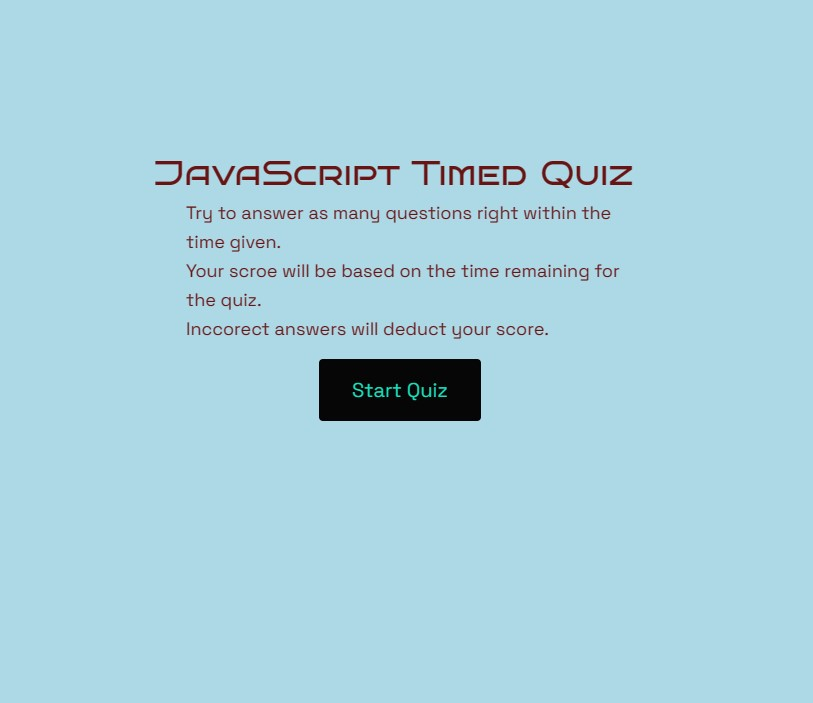

# JavaScript Quiz

## Description
A timed quiz application with a highscores leader board made using primarly JS. This project is for the MSU Bootcamp week 4 challenge. 
Most of the quiz application parts where created in the .js file using '.createElement' and appending it onto the main html file.

## Website Link
[Website Link](https://roamingheart.github.io/js-quiz/)

## Website Preview

## Requirments
GIVEN I am taking a code quiz
WHEN I click the start button
THEN a timer starts and I am presented with a question
WHEN I answer a question
THEN I am presented with another question
WHEN I answer a question incorrectly
THEN time is subtracted from the clock
WHEN all questions are answered or the timer reaches 0
THEN the game is over
WHEN the game is over
THEN I can save my initials and my score

## Usage
Users can take a short quiz can get a score depending on how long they took to finish the quiz. Users can then enter in their initials and be placed onto the highscores with their score.

## Credits
Thank you to [CodingNepal](https://www.codingnepalweb.com/quiz-app-with-timer-javascript/) for getting me started in wrapping my head around what I need to do. Thank you to [Kylie Fox](https://github.com/kmfox1087/API-CODE-QUIZ-CHALLENGE-4) for helping me condense the code I had written into a more simple and easy format.

Create a Quiz App with Timer using HTML CSS & JavaScript. (2020, October 6). CodingNepal. https://www.codingnepalweb.com/quiz-app-with-timer-javascript/

Fox, Kylie. (2023, April 26). GitHub - kmfox1087/API-CODE-QUIZ-CHALLENGE-4. GitHub. https://github.com/kmfox1087/API-CODE-QUIZ-CHALLENGE-4

## Liscense 
Please refer to the LICENSE in the repo.